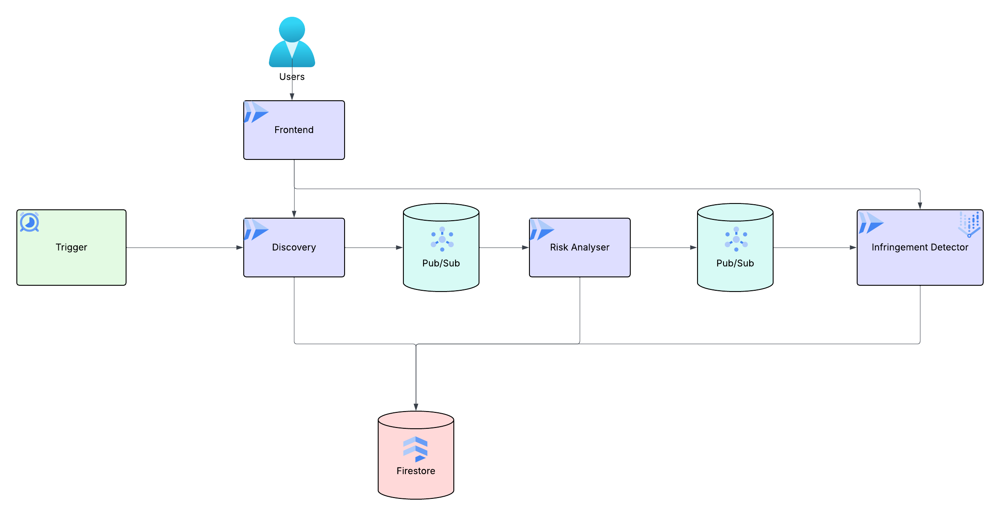

# Copycat

An AI-powered system for detecting unauthorized use of copyrighted characters in AI-generated videos on YouTube. Built to monitor for Justice League characters (Superman, Batman, Wonder Woman, Flash, Aquaman, Cyborg, Green Lantern) appearing in content created by AI video generators like Sora, Runway, Kling, and Pika.

## How It Works

The system runs as a pipeline of microservices on Google Cloud:

1. **[Discovery Service](services/discovery-service/README.md)** - Continuously scans YouTube for new AI-generated videos using keyword searches and channel tracking
2. **[Risk Analyzer](services/risk-analyzer-service/README.md)** - Scores videos based on multiple factors (channel history, view velocity, metadata signals) to prioritize what gets analyzed
3. **[Vision Analyzer](services/vision-analyzer-service/README.md)** - Uses Gemini 2.5 Flash to analyze video content and detect character appearances

Videos flagged as potential infringements are stored in Firestore with detailed analysis results for review through the **[Frontend](services/frontend-service/README.md)** dashboard, served via the **[API Service](services/api-service/README.md)**.

## Deployment

```bash
# Deploy a service to dev environment
./deploy.sh <service-name> dev

# Deploy to production
./deploy.sh <service-name> prod
```

Or push to `develop` (deploys to dev) or `main` (deploys to prod) - CI/CD handles the rest.

## Project Structure

```
copycat/
├── services/
│   ├── api-service/             # REST API gateway
│   ├── discovery-service/       # YouTube video discovery
│   ├── risk-analyzer-service/   # Risk scoring and prioritization
│   ├── vision-analyzer-service/ # Gemini-based video analysis
│   └── frontend-service/        # React dashboard
├── terraform/                   # Shared GCP infrastructure
├── scripts/                     # Utility scripts
└── deploy.sh                    # Deployment script
```

## Documentation

| Document | Description |
|----------|-------------|
| [API Service](services/api-service/README.md) | REST API gateway, authentication, RBAC |
| [Discovery Service](services/discovery-service/README.md) | YouTube scanning, channel tracking, quota management |
| [Risk Analyzer](services/risk-analyzer-service/README.md) | Priority scoring, adaptive learning |
| [Vision Analyzer](services/vision-analyzer-service/README.md) | Gemini analysis, budget management |
| [Frontend](services/frontend-service/README.md) | React dashboard, IAP authentication |
| [Terraform](terraform/README.md) | GCP infrastructure (Firestore, Pub/Sub, IAP, etc.) |
| [CLAUDE.md](CLAUDE.md) | Development guidelines |

## Architecture

<!-- Add your architecture diagram here -->
<!--  -->

- All services are Python/FastAPI, deployed as Cloud Run containers
- Services communicate via Pub/Sub (async) and direct HTTP calls (sync)
- Firestore is the primary database
- Vision analysis uses Gemini via Vertex AI
- Frontend protected by Identity-Aware Proxy (IAP)
- The system processes 20-30k videos/day within a ~$260/day Gemini budget

## Configuration

Configuration is managed through:
- Environment variables (set via Terraform/Cloud Run)
- Firestore documents (runtime config like keywords, channel tiers)
- Terraform (infrastructure) - see [terraform/README.md](terraform/README.md)
